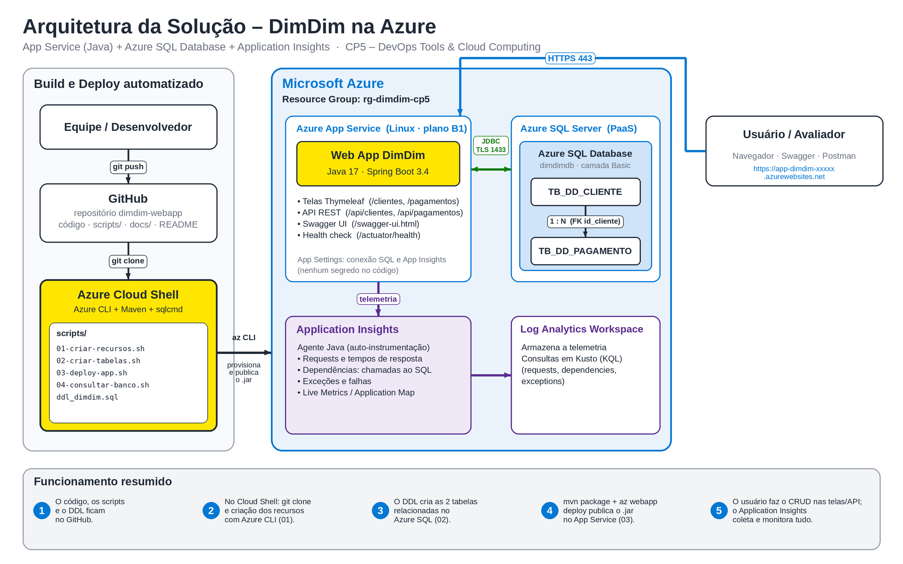

# DimDim — Web App de Pagamentos na Azure

**CP5 — DevOps Tools & Cloud Computing (2º Checkpoint, 2º Semestre — Aplicações e Banco em Nuvem)**

| | |
|---|---|
| **Grupo** | `[PREENCHER: nome do grupo]` |
| **Vídeo com as evidências** | `[PREENCHER: link do vídeo]` |

| Integrante | RM |
|---|---|
| Felipe Wiclif Leal da Silva | 563901 |
| Deryk de Souza Queiroz | 563412 |
| Lucas Gonçalves Viana | 563254 |
| Vinicius Paschoeto da Silva | 563089 |

---

## 1. Descrição da solução

O **DimDim** é um Web App de pagamentos. A consultoria do grupo entrega ao cliente (DimDim) uma aplicação que cadastra **clientes** e registra os **pagamentos** de cada cliente (Pix, cartão ou boleto), com tudo executando na nuvem da Microsoft Azure:

- **Aplicação:** Java 17 + Spring Boot, com **telas web** (Thymeleaf) e uma **API REST** documentada no **Swagger**.
- **Banco de dados:** **Azure SQL Database** (PaaS, não containerizado) com **2 tabelas relacionadas** e CRUD completo em ambas.
- **Deploy automatizado:** **Azure CLI + `az webapp deploy`** (scripts na pasta [`scripts/`](scripts)).
- **Monitoramento:** **Application Insights** (agente Java) enviando a telemetria para um Log Analytics Workspace.

Este projeto **não é** o projeto da Sprint 3 (que usava ACR + ACI + PostgreSQL em container).

### Modelo de dados (relacionamento 1 : N)

```
TB_DD_CLIENTE (1) ────< (N) TB_DD_PAGAMENTO
 id_cliente (PK)             id_pagamento (PK)
 nome                        id_cliente (FK -> TB_DD_CLIENTE)
 email (único)               descricao
 cpf (único)                 valor            (> 0)
 telefone                    metodo           (PIX | CARTAO | BOLETO)
 dt_cadastro                 status           (PENDENTE | APROVADO | CANCELADO)
                             dt_pagamento
```

O DDL completo está em [`scripts/ddl_dimdim.sql`](scripts/ddl_dimdim.sql).

## 2. Arquitetura da solução



| Recurso Azure | Função |
|---|---|
| Resource Group `rg-dimdim-cp5` | Agrupa todos os recursos (e permite apagar tudo de uma vez) |
| Azure SQL Server + Database `dimdimdb` (Basic) | Banco PaaS onde os dados são persistidos |
| App Service Plan (Linux, B1) + Web App (Java 17) | Executa a aplicação |
| Application Insights + Log Analytics Workspace | Monitoramento da aplicação e das chamadas ao banco |

## 3. Tecnologias

Java 17 · Spring Boot 3.4 (Web, Data JPA, Validation, Thymeleaf, Actuator) · springdoc-openapi (Swagger) · driver `mssql-jdbc` · Maven · Azure CLI · Azure SQL Database · Azure App Service · Application Insights.

## 4. Estrutura do repositório

```
dimdim-webapp/
├── README.md                       <- este How-to
├── pom.xml
├── docs/
│   ├── arquitetura.png             <- desenho da arquitetura
│   └── json-operacoes.md           <- JSON de GET, POST, PUT e DELETE
├── scripts/
│   ├── ddl_dimdim.sql              <- DDL das tabelas
│   ├── 00-variaveis.sh             <- nomes dos recursos (sem segredos)
│   ├── 01-criar-recursos.sh        <- Azure CLI: cria os recursos
│   ├── 02-criar-tabelas.sh         <- executa o DDL no Azure SQL
│   ├── 03-deploy-app.sh            <- mvn package + az webapp deploy
│   ├── 04-consultar-banco.sh       <- SELECT nas 2 tabelas (evidência)
│   └── 99-limpar-recursos.sh       <- apaga o resource group
└── src/                            <- código-fonte da aplicação
```

---

## 5. How to — implantação passo a passo na Azure

Tudo é feito pelo **Azure Cloud Shell (Bash)**, que já traz `az`, `git`, `mvn`, `java` e `sqlcmd`.
Nenhuma senha fica no código: o script pede a senha do SQL no terminal (sem exibir) e a grava somente nas *App Settings* do Web App.

### Passo 0 — Abrir o Cloud Shell
Acesse <https://portal.azure.com>, clique no ícone **`>_`** (Cloud Shell) no topo e escolha **Bash**.
Confira a assinatura em uso:
```bash
az account show --query "{nome:name, id:id}" -o table
```
Se precisar trocar: `az account set --subscription "<NOME OU ID DA ASSINATURA>"`.

### Passo 1 — Clonar o repositório
```bash
git clone [PREENCHER: URL do repositório no GitHub].git
cd dimdim-webapp
```

### Passo 2 — Definir a senha do administrador do SQL
Mínimo de 12 caracteres, com maiúscula, minúscula, número e símbolo. O comando abaixo não mostra o que você digita:
```bash
read -r -s -p "Senha do SQL: " SQL_ADMIN_PASSWORD; export SQL_ADMIN_PASSWORD; echo
```
> Se o Cloud Shell reiniciar, basta repetir este passo (os scripts também perguntam a senha quando a variável não existe).

### Passo 3 — Criar os recursos na Azure (Azure CLI)
```bash
bash scripts/01-criar-recursos.sh
```
Cria: Resource Group, Azure SQL Server + Database, Log Analytics, Application Insights, App Service Plan, Web App e as App Settings (conexão com o banco e Application Insights).
Ao final o script imprime a URL do Web App.

> Região padrão: `brazilsouth`. Se a assinatura bloquear (erro `RegionDoesNotAllowProvisioning` ou falta de quota), veja a seção [Problemas comuns](#8-problemas-comuns).

### Passo 4 — Criar as tabelas (DDL)
```bash
bash scripts/02-criar-tabelas.sh
```
Executa [`scripts/ddl_dimdim.sql`](scripts/ddl_dimdim.sql) e lista `TB_DD_CLIENTE` e `TB_DD_PAGAMENTO`.

### Passo 5 — Deploy da aplicação
```bash
bash scripts/03-deploy-app.sh
```
Compila com Maven (`mvn package`; na 1ª vez baixa dependências e leva alguns minutos), publica o `.jar` com `az webapp deploy` e aguarda `/actuator/health` responder 200. Ao final mostra as URLs das telas e do Swagger.

### Passo 6 — Abrir a aplicação
- Telas: `https://<WEBAPP>.azurewebsites.net/`
- Swagger: `https://<WEBAPP>.azurewebsites.net/swagger-ui.html`

(`<WEBAPP>` é o nome impresso no final do passo 3, no formato `app-dimdim-NNNNN`.)

---

## 6. Testes e evidência de persistência

Sempre que fizer uma operação, **confira o dado no banco**:
```bash
bash scripts/04-consultar-banco.sh
```
(ou, no portal: *SQL Database `dimdimdb` → Query editor* e rode `SELECT * FROM dbo.TB_DD_CLIENTE;` / `SELECT * FROM dbo.TB_DD_PAGAMENTO;`).

### 6.1 Pelas telas (front-end)
| Operação | Tabela | Como fazer |
|---|---|---|
| **C**reate | `TB_DD_CLIENTE` | *Clientes → Novo cliente* |
| **R**ead | `TB_DD_CLIENTE` | *Clientes* (listagem) |
| **U**pdate | `TB_DD_CLIENTE` | *Editar* na linha do cliente |
| **C**reate | `TB_DD_PAGAMENTO` | *Pagamentos → Novo pagamento* (escolhe o cliente) |
| **R**ead | `TB_DD_PAGAMENTO` | *Pagamentos* (listagem) |
| **U**pdate | `TB_DD_PAGAMENTO` | *Editar* (ex.: status `APROVADO`) |
| **D**elete | `TB_DD_PAGAMENTO` | *Excluir* na linha do pagamento |
| **D**elete | `TB_DD_CLIENTE` | *Excluir* o cliente (só sem pagamentos) |

### 6.2 Pela API (Swagger)
Abra `/swagger-ui.html`, use *Try it out* nos grupos **Clientes** e **Pagamentos** (GET, POST, PUT, DELETE).
Exemplos de JSON de cada operação: [`docs/json-operacoes.md`](docs/json-operacoes.md).

---

## 7. Monitoramento com Application Insights

O agente Java do Application Insights é ativado pelas App Settings `APPLICATIONINSIGHTS_CONNECTION_STRING` e `ApplicationInsightsAgent_EXTENSION_VERSION=~3` (configuradas pelo script 01), sem alterar o código.

No portal, abra o recurso **`appi-dimdim-NNNNN`** e use:

| Menu | O que mostra |
|---|---|
| **Live Metrics** | Requisições, falhas e chamadas ao SQL em tempo real (use enquanto faz o CRUD) |
| **Application map** | Web App → Azure SQL Database (dependência) |
| **Transaction search** | Cada requisição (`GET /clientes`, `POST /api/pagamentos`…) e as chamadas SQL associadas |
| **Performance** / **Failures** | Tempos de resposta e erros por operação |
| **Logs** | Consultas KQL, por exemplo: |

```kusto
requests
| where timestamp > ago(30m)
| project timestamp, name, resultCode, duration
| order by timestamp desc
```
```kusto
dependencies
| where timestamp > ago(30m) and type has "SQL"
| project timestamp, name, target, duration, success
| order by timestamp desc
```
> A telemetria pode levar alguns minutos para aparecer em *Logs*; o *Live Metrics* é imediato.

Logs da aplicação em tempo real: `az webapp log tail --resource-group rg-dimdim-cp5 --name <WEBAPP>`.

---

## 8. Problemas comuns

| Sintoma | O que fazer |
|---|---|
| `RegionDoesNotAllowProvisioning` / região bloqueada para SQL ou App Service | `bash scripts/99-limpar-recursos.sh`, depois `export LOCATION=eastus2` (ou `eastus`, `centralus`) e repita o passo 3 |
| Erro de quota do plano `B1` | Troque a região (acima) ou use `export SKU_PLANO=S1` antes do passo 3 |
| `runtime not supported` | Rode `az webapp list-runtimes --os-type linux \| grep -i java` e ajuste `export RUNTIME="JAVA:17-java17"` |
| `mvn`/`java` com versão antiga | Confirme `java -version` (precisa ser 17 ou superior); o Cloud Shell já atende |
| `sqlcmd` não encontrado | Use o Cloud Shell, ou cole o conteúdo de `scripts/ddl_dimdim.sql` no *Query editor* do portal |
| Aplicação não sobe (health ≠ 200) | Confirme que o passo 4 foi executado e veja `az webapp log tail …` |
| *Query editor* pede liberação de IP | Clique em **Allowlist IP** na mensagem exibida pelo portal |

## 9. Limpeza dos recursos

Depois da entrega ser corrigida, apague tudo para não gerar custo:
```bash
bash scripts/99-limpar-recursos.sh
```

## 10. Segurança

- Nenhuma senha, usuário ou token no repositório: a conexão com o banco vem de **variáveis de ambiente** (App Settings do Web App) definidas pelo script 01 a partir da senha digitada no terminal.
- `scripts/.dimdim.env` (apenas o sufixo dos nomes, sem segredos) está no `.gitignore`.
- Os CPFs usados nos testes são fictícios.
- Melhoria futura: trocar o login SQL por *Managed Identity* e guardar segredos no Key Vault.
